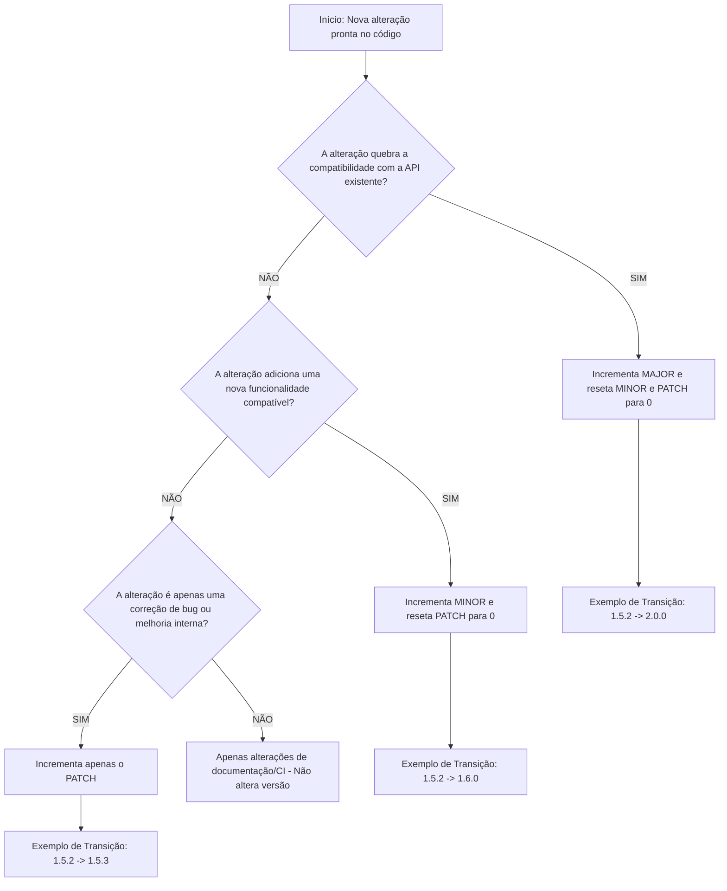

# pc-lopal
Repositório para armazenar os códigos da aula. 

Desafios e Atividades:

Desafio 1:

# Versionamento Semântico (SemVer) no Ecossistema JavaScript


> **Guia Definitivo e Completo sobre Estrutura, Governança, Exemplos Práticos de Código e Automação de Versões**

---

## 📋 Sumário
- [1. Introdução e o "Dependency Hell"](#1-introdução-e-o-dependency-hell)
- [2. O que Significa Cada um dos Três Números (MAJOR.MINOR.PATCH)](#2-o-que-significa-cada-um-dos-três-números-majorminorpatch)
  - [2.1. MAJOR (Versão Maior / Quebra de Compatibilidade)](#21-major-versão-maior--quebra-de-compatibilidade)
  - [2.2. MINOR (Versão Menor / Novas Funcionalidades)](#22-minor-versão-menor--novas-funcionalidades)
  - [2.3. PATCH (Versão de Correção / Ajustes de Bugs)](#23-patch-versão-de-correção--ajustes-de-bugs)
- [3. Exemplos Práticos de Código em JavaScript](#3-exemplos-práticos-de-código-em-javascript)
  - [3.1. PATCH — Correção Interna de Bug (1.0.0 → 1.0.1)](#31-patch--correção-interna-de-bug-100--101)
  - [3.2. MINOR — Adição de Nova Funcionalidade Retrocompatível (1.0.1 → 1.1.0)](#32-minor--adição-de-nova-funcionalidade-retrocompatível-101--110)
  - [3.3. MAJOR — Mudança Incompatível / Breaking Change (1.1.0 → 2.0.0)](#33-major--mudança-incompatível--breaking-change-110--200)
- [4. Sufixos de Pré-Lançamento e Metadados de Compilação](#4-sufixos-de-pré-lançamento-e-metadados-de-compilação)
- [5. O Caso Especial da Versão 0.X.Y (Fase Inicial)](#5-o-caso-especial-da-versão-0xy-fase-inicial)
- [6. Quem Decide Como o Número Muda e Com Base em Quê?](#6-quem-decide-como-o-número-muda-e-com-base-em-quê)
  - [6.1. O Processo de Tomada de Decisão dos Mantenedores](#61-o-processo-de-tomada-de-decisão-dos-mantenedores)
  - [6.2. Fluxograma Mermaid de Decisão](#62-fluxograma-mermaid-de-decisão)
- [7. Governança e Automação com Conventional Commits](#7-governança-e-automação-com-conventional-commits)
- [8. Como o package.json Interpreta o SemVer (~ vs ^ vs Exato)](#8-como-o-packagejson-interpreta-o-semver--vs--vs-exato)
- [9. Matriz Resumo de Referência Rápida](#9-matriz-resumo-de-referência-rápida)

---

## 1. Introdução e o "Dependency Hell"

No ecossistema **JavaScript** (Node.js, navegadores e frameworks como React, Vue e Angular), uma aplicação moderna raramente é escrita do zero. Ela se apoia em centenas ou até milhares de pacotes externos gerenciados por gerenciadores como **npm**, **yarn** ou **pnpm**.

Historicamente, quando os desenvolvedores atualizavam as dependências de seus projetos, alterações imprevisíveis no código de terceiros frequentemente quebravam sistemas inteiros sem aviso prévio. Esse fenômeno foi apelidado de **Dependency Hell** (*O Inferno das Dependências*).

Para mitigar esse caos, foi estabelecida a especificação formal do **Versionamento Semântico** (*Semantic Versioning* ou **SemVer**). O SemVer atua como um **contrato público e transparente** entre os mantenedores de uma biblioteca e os desenvolvedores que a utilizam. A premissa básica é simples: **apenas olhando para o número da versão, você deve saber exatamente o grau de risco e o tipo de alteração contido naquela atualização.**

---

## 2. O que Significa Cada um dos Três Números (`MAJOR.MINOR.PATCH`)

A estrutura canônica do SemVer consiste em três inteiros não negativos separados por pontos:

```text
       ┌────────────────────────────── MAJOR (Quebra de compatibilidade / Breaking changes)
       │   ┌────────────────────────── MINOR (Novas funcionalidades retrocompatíveis)
       │   │   ┌────────────────────── PATCH (Correções de bugs e otimizações)
       ▼   ▼   ▼
     [ 2 . 4 . 1 ]
```

> [!NOTE]
> Todos os números aumentam de forma estritamente numérica (ex.: `1.9.0` passa para `1.10.0` e depois `1.11.0`, e não para `2.0.0`).

---

### ⚠️ 2.1. MAJOR (Versão Maior / Quebra de Compatibilidade)
* **Quando muda:** Sempre que ocorrem **mudanças incompatíveis com a API pública existente** (*breaking changes*).
* **Impacto no projeto:** **Alto.** Existe risco real de que a aplicação pare de funcionar ou apresente erros em tempo de execução/compilação até que o código seja modificado para se adequar às novas regras da biblioteca.
* **Exemplos práticos de mudanças:**
  * Remoção ou renomeação de funções, métodos, classes ou variáveis exportadas.
  * Alteração dos tipos de retorno ou da ordem e quantidade de parâmetros obrigatórios.
  * Alteração em requisitos de infraestrutura ou ambiente (ex.: exigir Node.js 18+ e abandonar Node.js 16).
* **Regra de reset:** Quando o `MAJOR` incrementa, os números `MINOR` e `PATCH` **retornam obrigatoriamente a `0`**.
  * *Exemplo:* `1.8.4` ➔ `2.0.0`

---

### 🚀 2.2. MINOR (Versão Menor / Novas Funcionalidades)
* **Quando muda:** Quando **novas funcionalidades** são adicionadas à biblioteca, mantendo **100% de compatibilidade** com o código que já existia (*backward compatibility*).
* **Impacto no projeto:** **Baixo.** O código escrito anteriormente continuará rodando exatamente da mesma maneira, mas agora há novos recursos disponíveis para uso opcional.
* **Exemplos práticos de mudanças:**
  * Adição de uma nova função, módulo ou componente exportado.
  * Adição de um parâmetro *opcional* em uma função já existente.
  * Depreciação (*deprecation*) de uma função antiga — ou seja, o recurso continua funcionando, mas exibe um aviso informando que será removido no próximo `MAJOR`.
* **Regra de reset:** Quando o `MINOR` incrementa, o `PATCH` **retorna obrigatoriamente a `0`**, enquanto o `MAJOR` permanece inalterado.
  * *Exemplo:* `1.4.2` ➔ `1.5.0`

---

### 🛠️ 2.3. PATCH (Versão de Correção / Ajustes de Bugs)
* **Quando muda:** Quando são feitas **correções de falhas (bugs)**, pequenas otimizações de desempenho ou ajustes internos que **não alteram** a forma como os desenvolvedores interagem com a biblioteca.
* **Impacto no projeto:** **Mínimo.** É uma atualização segura e altamente recomendada, pois torna a biblioteca mais estável ou segura sem mudar o comportamento esperado das funções.
* **Exemplos práticos de mudanças:**
  * Correção de um cálculo matemático incorreto em um método interno.
  * Resolução de falhas de segurança (*vulnerabilidades*) ou vazamentos de memória (*memory leaks*).
  * Refatoração interna de código mantendo intactos os dados de entrada e saída.
* **Regra de reset:** O `PATCH` é incrementado mantendo `MAJOR` e `MINOR` inalterados.
  * *Exemplo:* `1.0.0` ➔ `1.0.1`

---

## 3. Exemplos Práticos de Código em JavaScript

Para visualizar como as atualizações do SemVer funcionam no código-fonte real, imagine uma biblioteca utilitária de pagamentos chamada `payment-utils`.

### 3.1. PATCH — Correção Interna de Bug (`1.0.0` ➔ `1.0.1`)

> **Cenário:** A função de desconto falhava ao receber o preço como uma `string` numérica em vez de um `number`. A correção apenas assegura o tipo numérico.

```javascript
// ==========================================
// VERSÃO 1.0.0 (Com Bug)
// ==========================================
function calcularDesconto(preco, cupom) {
  if (cupom === "PROMO10") {
    // Se preco for "100" (string), resulta em 90, mas pode gerar inconsistências
    return preco * 0.9; 
  }
  return preco;
}

// ==========================================
// VERSÃO 1.0.1 (PATCH Fix - Correção de Bug)
// ==========================================
function calcularDesconto(preco, cupom) {
  const precoValido = Number(preco); // Tratamento e sanitização interna
  if (isNaN(precoValido)) {
    throw new Error("O preço fornecido deve ser um número válido.");
  }

  if (cupom === "PROMO10") {
    return precoValido * 0.9;
  }
  return precoValido;
}
```

---

### 3.2. MINOR — Adição de Nova Funcionalidade Retrocompatível (`1.0.1` ➔ `1.1.0`)

> **Cenário:** O time adicionou suporte a um novo código de cupom (`PROMO20`) e um parâmetro opcional de configuração para aplicação de frete grátis.

```javascript
// ==========================================
// VERSÃO 1.1.0 (MINOR Feature - Compatível)
// ==========================================
function calcularDesconto(preco, cupom, opcoes = { freteGratis: false }) {
  const precoValido = Number(preco);
  if (isNaN(precoValido)) {
    throw new Error("O preço fornecido deve ser um número válido.");
  }

  let precoFinal = precoValido;

  // Novo cupom adicionado sem afetar os existentes!
  if (cupom === "PROMO10") precoFinal = precoValido * 0.9;
  if (cupom === "PROMO20") precoFinal = precoValido * 0.8;

  if (opcoes.freteGratis) {
    console.log("[PAYMENT-UTILS] Cupom de Frete Grátis aplicado com sucesso.");
  }

  return precoFinal;
}

// ------------------------------------------
// CÓDIGO DO CONSUMIDOR (Não quebra nada!):
// ------------------------------------------
// Chamada antiga (versão 1.0.0) continua funcionando perfeitamente:
const valor1 = calcularDesconto(100, "PROMO10"); // Retorna 90

// Novo recurso da versão 1.1.0 disponível para uso:
const valor2 = calcularDesconto(100, "PROMO20", { freteGratis: true }); // Retorna 80
```

---

### 3.3. MAJOR — Mudança Incompatível / Breaking Change (`1.1.0` ➔ `2.0.0`)

> **Cenário:** O time reformulou a biblioteca para usar um único objeto de configuração como parâmetro (em vez de argumentos posicionais) e removeu o cupom antigo `PROMO10`.

```javascript
// ==========================================
// VERSÃO 2.0.0 (MAJOR Breaking Change)
// ==========================================
// A assinatura mudou: AGORA exige um único objeto desestruturado!
function calcularDesconto({ valor, codigoCupom, opcoes = {} }) {
  if (!valor) {
    throw new Error("A propriedade 'valor' no objeto de parâmetros é obrigatória.");
  }

  const precoValido = Number(valor);

  // O cupom 'PROMO10' foi removido permanentemente!
  if (codigoCupom === "PROMO20") return precoValido * 0.8;
  if (codigoCupom === "SUPER50") return precoValido * 0.5;

  return precoValido;
}

// ------------------------------------------
// CÓDIGO DO CONSUMIDOR:
// ------------------------------------------

// ❌ CÓDIGO ANTIGO (Irá FALHAR e QUEBRAR na v2.0.0):
// calcularDesconto(100, "PROMO10");
// TypeError: Cannot destructure property 'valor' of 'undefined' or 'null'.

// ✅ CÓDIGO ATUALIZADO (Exigido após migrar para v2.0.0):
const valorFinal = calcularDesconto({
  valor: 100,
  codigoCupom: "PROMO20"
});
```

---

## 4. Sufixos de Pré-Lançamento e Metadados de Compilação

O SemVer suporta sufixos específicos para gerenciar ciclos de testes, homologação e metadados de build:

```text
  2.0.0-alpha.1      ➔ Versão Alpha (Início de desenvolvimento, altamente instável)
  2.0.0-beta.2       ➔ Versão Beta (Funcionalidades completas, em testes com comunidade)
  2.0.0-rc.1         ➔ Release Candidate (Candidato a lançamento oficial)
  2.0.0+20260813     ➔ Versão Final + Metadados de Compilação (Data ou Hash Git)
```

| Sufixo | Significado | Finalidade e Uso Recomendado |
| :--- | :--- | :--- |
| **`-alpha`** | *Alpha* | Testes internos do próprio time de desenvolvimento. |
| **`-beta`** | *Beta* | Testes abertos para a comunidade reportar bugs. |
| **`-rc`** | *Release Candidate* | Validação final em ambiente de homologação (*staging*). |
| **`+build`** | *Build Metadata* | Anexar rastreabilidade de CI/CD (não afeta precedência de versão). |

---

## 5. O Caso Especial da Versão `0.X.Y` (Fase Inicial)

> [!WARNING]
> Qualquer versão com `0.x.x` (como `0.1.0`, `0.4.2`) é considerada **inicial e em desenvolvimento ativo**.

* A API pública **não deve ser considerada estável**.
* *Breaking changes* podem ocorrer a qualquer momento em incrementos de `MINOR` ou até `PATCH`.
* O lançamento da versão **`1.0.0`** é o marco formal que declara a **primeira API pública estável** do projeto.

---

## 6. Quem Decide Como o Número Muda e Com Base em Quê?

### 6.1. O Processo de Tomada de Decisão dos Mantenedores

1. **Quem decide?**
   A responsabilidade é exclusivamente dos **mantenedores do projeto** (os desenvolvedores originais, o time de engenharia da empresa ou a comunidade gestora de código aberto).

2. **Com base em quê?**
   A decisão baseia-se unicamente no **grau de impacto das alterações na API Pública**. Os mantenedores avaliam cada *Pull Request* (PR) aprovado antes do lançamento.

### 6.2. Fluxograma Mermaid de Decisão

Abaixo está o fluxo lógico oficial para determinar o próximo número de versão:



---

## 7. Governança e Automação com Conventional Commits

Em projetos modernos, o processo de escolha de versão não é feito manualmente. As equipes utilizam o padrão de mensagens de commit chamado **Conventional Commits** combinado com pipelines de **CI/CD** (como GitHub Actions):

```bash
# Executa um incremento de PATCH automático (ex: 1.0.0 -> 1.0.1)
git commit -m "fix: corrige vazamento de memória ao fechar conexão com banco"

# Executa um incremento de MINOR automático (ex: 1.0.0 -> 1.1.0)
git commit -m "feat: adiciona suporte para exportação de dados em formato PDF"

# Executa um incremento de MAJOR automático (ex: 1.0.0 -> 2.0.0)
git commit -m "feat!: altera padrão de autenticação para JWT e remove suporte a sessões
BREAKING CHANGE: O método antigo 'authenticateSession()' foi descontinuado."
```

Ferramentas como **Semantic Release** ou **Changesets** leem esse histórico de commits no momento da integração contínua e publicam a versão exata no registro do **npm** sem interferência humana manual.

---

## 8. Como o `package.json` Interpreta o SemVer (`~` vs `^` vs Exato)

No ecossistema Node.js, quando você declara uma dependência no arquivo `package.json`, são utilizados prefixos para instruir o gerenciador de pacotes sobre quais atualizações aceitar automaticamente:

```json
{
  "name": "meu-projeto",
  "dependencies": {
    "pacote-exato": "1.2.3",
    "pacote-patch": "~1.2.3",
    "pacote-minor": "^1.2.3",
    "pacote-curinga": "*"
  }
}
```

| Operador | Exemplo | Aceita Atualizações Automáticas Até | Bloqueia Atualizações |
| :---: | :---: | :--- | :--- |
| **Exato** | `1.2.3` | **Apenas** a versão `1.2.3` exata. | Qualquer versão diferente. |
| **Til (`~`)** | `~1.2.3` | Atualizações de **PATCH** (`1.2.3` até `1.2.99`). | `1.3.0` ou superior. |
| **Circunflexo (`^`)** | `^1.2.3` | Atualizações de **MINOR e PATCH** (`1.2.3` até `1.99.99`). | `2.0.0` ou superior. |
| **Curinga (`*`)** | `*` | **Qualquer** versão nova publicada. | Nenhuma (Extremamente arriscado). |

---

## 9. Matriz Resumo de Referência Rápida

| Componente | Nome | O que representa? | Nível de Risco ao Atualizar |
| :---: | :---: | :--- | :---: |
| **MAJOR** (X.0.0) | **Maior** | Mudanças incompatíveis (*Breaking Changes*) | 🔴 **Alto** (Aplicações podem quebrar) |
| **MINOR** (0.Y.0) | **Menor** | Novas funcionalidades compatíveis com código antigo | 🟡 **Baixo** (Novos recursos opcionais) |
| **PATCH** (0.0.Z) | **Correção** | Correções de bugs, segurança e refatoração interna | 🟢 **Mínimo** (Atualização recomendada) |

---

> **Conclusão:** O Versionamento Semântico ultrapassa a simples rotulagem de arquivos: ele é uma disciplina de engenharia de software indispensável. Ele viabiliza que ecossistemas imensos e distribuídos como o JavaScript continuem evoluindo de forma rápida, segura e automatizada.

Desafio 2: 

# Guia Completo: `dependencies` vs `devDependencies` no `package.json`

## 1. Introdução ao `package.json`

No ecossistema de desenvolvimento **Node.js** e **JavaScript/TypeScript**, o arquivo `package.json` atua como o manifesto central de um projeto. Ele contém metadados vitais (nome, versão, autor, licença), scripts de automação e, fundamentalmente, o mapeamento de todas as bibliotecas e pacotes externos dos quais o projeto depende para funcionar ou ser desenvolvido.

Dentro do `package.json`, o gerenciamento de pacotes externos é dividido principalmente em duas seções de dependências:

*   `dependencies`
*   `devDependencies`

Entender a diferença conceitual e prática entre esses dois grupos é essencial para a saúde, segurança, performance e arquitetura de implantação (*deploy*) de qualquer aplicação moderna.

---

## 2. Diferença Fundamental Entre os Grupos

| Critério | `dependencies` | `devDependencies` |
| :--- | :--- | :--- |
| **Definição** | Dependências de Execução / Produção (*Runtime*) | Dependências de Desenvolvimento / Auxiliares (*Build/Test*) |
| **Momento de Uso** | Durante a execução do sistema final pelo usuário ou servidor. | Durante o desenvolvimento local, testes, linting e processo de *build*. |
| **Necessário em Produção?** | **SIM**. Sem elas, o sistema quebra em tempo de execução. | **NÃO**. Não afetam a execução do código compilado/gerado em produção. |
| **Instalação via NPM** | `npm install <pacote>` | `npm install -D <pacote>` ou `npm install --save-dev <pacote>` |
| **Instalação em Produção** | Baixadas em `npm install --omit=dev` | **Ignoradas** em `npm install --omit=dev` |
| **Propagação Transitiva** | Baixadas automaticamente se alguém instalar seu pacote via NPM. | **Não** são baixadas pelos usuários que instalam seu pacote como biblioteca. |

---

### 2.1. O que são `dependencies`?

As **`dependencies`** (ou dependências de *runtime*) representam todo o código de terceiros que é **diretamente importado, invocado ou executado no ambiente final onde a aplicação roda**.

Se uma biblioteca é necessária para que uma rota de API responda, para que um componente de tela seja renderizado, para que o banco de dados seja consultado ou para que uma requisição HTTP seja feita **em tempo de execução**, ela pertence ao grupo de `dependencies`.

#### Exemplos Comuns:
*   **Frameworks e Bibliotecas Web/API:** `express`, `nest`, `react`, `react-dom`, `vue`, `angular`, `fastify`.
*   **Conectores e ORMs de Banco de Dados:** `prisma`, `pg`, `mongoose`, `sequelize`, `typeorm`.
*   **Utilitários de Runtime:** `axios`, `lodas-es`, `date-fns`, `jsonwebtoken`, `bcrypt`, `dotenv`.

---

### 2.2. O que são `devDependencies`?

As **`devDependencies`** (ou dependências de desenvolvimento) consistem em ferramentas, simuladores, compiladores e utilitários que **apoiam o desenvolvedor durante a escrita, verificação, compilação e teste do código**, mas que não fazem parte da lógica de negócio executada em produção.

Quando o projeto é compilado (por exemplo, transformando TypeScript em JavaScript ou bundling de arquivos com Vite/Webpack) e vai para o servidor final, essas ferramentas não precisam rodar em tempo de execução.

#### Exemplos Comuns:
*   **Compiladores e Transpiladores:** `typescript`, `@babel/core`, `swc`.
*   **Ferramentas de Build e Bundlers:** `vite`, `webpack`, `tsup`, `rollup`, `esbuild`.
*   **Frameworks e Utilitários de Teste:** `jest`, `vitest`, `cypress`, `playwright`, `supertest`, `@testing-library/react`.
*   **Linters, Formatadores e Qualidade de Código:** `eslint`, `prettier`, `husky`, `lint-staged`.
*   **Tipagens do TypeScript:** `@types/node`, `@types/react`, `@types/express`.

---

## 3. Como o Gerenciador de Pacotes (NPM/Yarn/PNPM) Trata Cada Grupo

### 3.1. Comandos de Instalação

Ao instalar pacotes pela linha de comando, a flag utilizada determina em qual seção o pacote será registrado dentro do `package.json`:

#### Adicionar a `dependencies`:
```bash
# NPM
npm install express

# Yarn
yarn add express

# PNPM
pnpm add express
```

#### Adicionar a `devDependencies`:
```bash
# NPM
npm install --save-dev jest
# ou a forma abreviada:
npm install -D jest

# Yarn
yarn add --dev jest
# ou abreviado:
yarn add -D jest

# PNPM
pnpm add -D jest
```

---

### 3.2. Comportamento no Deploy / Produção

Nos ambientes de integração contínua (CI/CD) e servidores de produção (Docker, AWS, Heroku, Vercel), é prática padrão otimizar a instalação ignorando dependências de desenvolvimento.

Ao rodar o comando:
```bash
npm install --omit=dev
# (Antigamente executado como: npm install --production)
```

O NPM lê o `package.json` e **baixa unicamente as bibliotecas contidas em `dependencies`**, deixando a pasta `node_modules` consideravelmente mais leve e segura.

---

### 3.3. Transitividade: Módulos Reutilizáveis vs. Aplicações Finais

O comportamento das dependências varia de acordo com a natureza do projeto:

1.  **Se você está desenvolvendo uma Biblioteca (Pacote NPM publicável):**
    *   Quando outro desenvolvedor instala o seu pacote no projeto dele (`npm install seu-pacote`), o gerenciador instala o seu pacote e **todas as `dependencies` listadas no `package.json` do seu pacote**.
    *   As suas `devDependencies` **não** são instaladas na máquina do consumidor. Isso previne que ferramentas como seus testes locais (`jest`) ou linters (`eslint`) poluam o projeto de quem está apenas consumindo sua biblioteca.

2.  **Se você está desenvolvendo uma Aplicação Web / Backend:**
    *   Para aplicações que sofrem processo de *build* (ex: React com Vite ou backend em TypeScript):
        *   Em containers **Docker Multi-stage**, utiliza-se `devDependencies` na etapa de *build* para transpilar o projeto.
        *   Na etapa final (imagem de execução em produção), instalam-se apenas as `dependencies` (ou apenas os arquivos estáticos compilados), garantindo imagens menores e mais seguras.

---

## 4. Guia e Árvore de Decisão: Como Decidir em Qual Grupo Colocar?

Na dúvida sobre onde adicionar uma biblioteca, utilize o seguinte fluxo lógico de decisão:

```
O código desta biblioteca é importado ou necessário
para a execução da aplicação em PRODUÇÃO?
 ├── SIM ──> Pertence a: `dependencies`
 └── NÃO ──> A biblioteca serve para testar, compilar,
             formatar, analisar ou ajudar no desenvolvimento?
              ├── SIM ──> Pertence a: `devDependencies`
              └── NÃO ──> Reavalie a necessidade do pacote no projeto.
```

### Checklist Prático de Perguntas:

1.  **Se esta biblioteca for removida da pasta `node_modules` em produção, a aplicação vai quebrar no momento em que um usuário fizer uma requisição?**
    *   *Sim* $
ightarrow$ `dependencies` (ex: `express`, `mongoose`).
    *   *Não* $
ightarrow$ Continue avaliando.
2.  **O código desta biblioteca é empacotado no bundle final do cliente ou do servidor?**
    *   *Sim* $
ightarrow$ `dependencies` (ex: `react`, `lucide-react`).
3.  **A biblioteca é um pacote do repositório `@types/`?**
    *   *Sim* $
ightarrow$ `devDependencies` (Tipagens do TypeScript não existem em runtime JavaScript).
4.  **É uma ferramenta para executar testes automatizados?**
    *   *Sim* $
ightarrow$ `devDependencies` (ex: `vitest`, `cypress`).

---

## 5. Exemplo Prático de um `package.json` Real

Abaixo está um exemplo de manifesto de um projeto backend em **Node.js** utilizando **TypeScript**, **Express** e **Prisma ORM**:

```json
{
  "name": "minha-api-backend",
  "version": "1.0.0",
  "description": "API REST desenvolvida em Node.js e TypeScript",
  "main": "dist/server.js",
  "scripts": {
    "build": "tsc",
    "start": "node dist/server.js",
    "dev": "tsx watch src/server.ts",
    "test": "vitest",
    "lint": "eslint ."
  },
  "dependencies": {
    "@prisma/client": "^5.10.0",
    "bcryptjs": "^2.4.3",
    "cors": "^2.8.5",
    "dotenv": "^16.4.5",
    "express": "^4.19.2",
    "jsonwebtoken": "^9.0.2",
    "zod": "^3.22.4"
  },
  "devDependencies": {
    "@types/bcryptjs": "^2.4.6",
    "@types/cors": "^2.8.17",
    "@types/express": "^4.17.21",
    "@types/jsonwebtoken": "^9.0.6",
    "@types/node": "^20.11.24",
    "@typescript-eslint/eslint-plugin": "^7.1.0",
    "@typescript-eslint/parser": "^7.1.0",
    "eslint": "^8.57.0",
    "prisma": "^5.10.0",
    "prettier": "^3.2.5",
    "tsx": "^4.7.1",
    "typescript": "^5.3.3",
    "vitest": "^1.3.1"
  }
}
```

### Análise das Dependências do Exemplo:

*   **Em `dependencies`:**
    *   `express` fornece as rotas da API em tempo de execução.
    *   `@prisma/client` consulta o banco de dados durante as requisições dos usuários.
    *   `jsonwebtoken` valida os tokens de acesso nas requisições HTTP.
    *   `zod` valida os dados recebidos nas requisições no servidor.

*   **Em `devDependencies`:**
    *   `typescript` transpila o código `.ts` para `.js` antes do deploy.
    *   `prisma` (CLI) é usado apenas para rodar migrações em desenvolvimento e gerar o client.
    *   `eslint` e `prettier` checam e formatam o código para os desenvolvedores.
    *   `vitest` roda a suíte de testes locais/CI.
    *   Todos os pacotes `@types/*` fornecem autocompletar e checagem de tipos no editor de código (VS Code).

---

## 6. Outros Grupos de Dependências no `package.json` (Visão Expandida)

Embora `dependencies` e `devDependencies` sejam os grupos principais, o ecossistema Node.js possui outros grupos especializados:

1.  **`peerDependencies`:**
    *   Indica que o pacote exige que o projeto consumidor já possua uma determinada biblioteca instalada e em uma versão compatível. Muito comum no desenvolvimento de plugins ou bibliotecas de componentes UI (ex: um plugin do React exige que o projeto hospedeiro já tenha o `react` na versão `>=18`).
2.  **`optionalDependencies`:**
    *   Dependências que a aplicação tenta instalar, mas cuja falha na instalação não interrompe o processo do `npm install`. Utilizado para módulos nativos específicos de sistemas operacionais (ex: suporte a SWC para macOS ARM vs Linux x64).
3.  **`bundledDependencies` (ou `bundleDependencies`):**
    *   Um array de nomes de pacotes que serão empacotados e inclusos diretamente dentro do arquivo tarball (`.tgz`) na publicação da biblioteca.

---

## 7. Impactos e Boas Práticas na Engenharia de Software

Classificar corretamente os pacotes no `package.json` traz benefícios diretos para o ciclo de vida do software:

### 1. Segurança e Superfície de Ataque
Incluir bibliotecas de desenvolvimento em produção aumenta a quantidade de código e possíveis vulnerabilidades de segurança (CVEs) presentes no servidor de produção.

### 2. Desempenho e Tempo de Build em CI/CD
Imagens Docker e pipelines de implantação que baixam apenas as dependências de produção gastam significativamente menos banda e tempo de CPU na etapa final.

### 3. Consumo de Disco e Memória
Evita o inchaço desnecessário da pasta `node_modules` nos ambientes de homologação e produção.

---

## 8. Resumo Sintético para Atividades Escolares / Acadêmicas

> **Resumo:**
> * **`dependencies`**: Pacotes vitais para rodar a aplicação no servidor ou cliente final (ex: Express, React). Instala-se com `npm i <pacote>`.
> * **`devDependencies`**: Ferramentas auxiliares para o desenvolvedor durante a fase de criação, testes e build (ex: TypeScript, Jest, ESLint). Instala-se com `npm i -D <pacote>`.
> * **Regra de ouro:** Se o usuário final precisa da biblioteca para que a funcionalidade rode na aplicação final, é **`dependency`**. Se apenas o desenvolvedor/sistema de CI precisa para compilar, testar ou formatar, é **`devDependency`**.

Desafio 3:

# Guia Completo: Versionamento Semântico (SemVer) no `package.json`

## 1. Introdução ao Versionamento Semântico (SemVer)

No desenvolvimento de software com **Node.js** e **JavaScript/TypeScript**, a gestão de dependências depende diretamente de um padrão internacional conhecido como **SemVer** (*Semantic Versioning*, ou Versionamento Semântico).

O formato padrão de uma versão no SemVer é composto por três números separados por pontos:

$$\text{MAJOR} . \text{MINOR} . \text{PATCH}$$

Exemplo: `1.4.2`

### Entendendo os Componentes da Versão:

*   **MAJOR (Versão Maior / Principal) — Ex: `1`.0.0:**
    *   Incrementado quando há **mudanças incompatíveis com versões anteriores** (*breaking changes*).
    *   Ao mudar de `1.x.x` para `2.0.0`, o código da biblioteca foi alterado de forma que funções antigas podem ter sido removidas ou modificadas, exigindo que você adapte o seu código.
*   **MINOR (Versão Menor / Secundária) — Ex: 1.`4`.0:**
    *   Incrementado quando são adicionadas **novas funcionalidades**, mantendo **compatibilidade total com versões anteriores** (*backwards-compatible*).
    *   Seu código continuará funcionando sem quebras, mas agora novos recursos estão disponíveis.
*   **PATCH (Versão de Correção / Remendo) — Ex: 1.4.`2`:**
    *   Incrementado quando são feitas **correções de bugs** ou pequenas otimizações de desempenho, **sem alterar as funcionalidades existentes**.
    *   É totalmente seguro e recomendado atualizar.

No arquivo `package.json`, utilizamos **prefixos e símbolos** antes do número da versão para definir a política de atualização automática permitida para cada pacote.

---

## 2. Análise Detalhada dos Símbolos

### 2.1. O Símbolo do Carenagem / Chapeuzinho (`^` - Caret)

O caractere `^` é o **padrão adotado pelo NPM** ao instalar um pacote sem especificar a versão (ex: `npm install express`).

#### O que ele permite atualizar?
O circunflexo permite atualizar para **novas versões MINOR e PATCH**, mantendo o número **MAJOR fixo**.

Ele garante que você receba novas funcionalidades e correções de bugs, mas impede atualizações que tragam quebras de compatibilidade (*breaking changes*).

#### Exemplo Prático com `^1.4.2`:
*   Permite instalar: `1.4.3`, `1.5.0`, `1.9.12`
*   **Impede** instalar: `2.0.0` ou superior

#### Comportamento Especial para Versões Iniciais (`0.x.x`):
No SemVer, versões começando com `0` (ex: `0.4.2`) são consideradas instáveis e em fase de desenvolvimento ativo, onde qualquer alteração pode quebrar o código.
*   Para `^0.4.2`: O NPM fixa o `0.4` e permite atualizar apenas o **PATCH** (ex: `0.4.3`, `0.4.4`). **Não** atualiza para `0.5.0`.
*   Para `^0.0.3`: A versão é travada exatamente em `0.0.3`.

---

### 2.2. O Símbolo do Til (`~` - Tilde)

O caractere `~` adota uma política de atualização muito mais conservadora e restritiva.

#### O que ele permite atualizar?
O til permite atualizar **apenas versões PATCH** (correções de bugs), mantendo os números **MAJOR e MINOR fixos**.

É utilizado quando você quer garantir a máxima estabilidade e não deseja que nenhuma nova funcionalidade (que possa introduzir efeitos colaterais) seja instalada automaticamente.

#### Exemplo Prático com `~1.4.2`:
*   Permite instalar: `1.4.3`, `1.4.4`, `1.4.99`
*   **Impede** instalar: `1.5.0` ou `2.0.0`

#### Variações com Notação Incompleta:
*   `~1.4` (sem especificar o patch): equivale a `>=1.4.0 <1.5.0` (atualiza apenas patches de `1.4`).
*   `~1` (apenas o major): equivale a `>=1.0.0 <2.0.0` (comportamento similar ao circunflexo nesse caso específico).

---

### 2.3. Versão Exata (Sem Nenhum Símbolo — ex: `1.4.2`)

Quando nenhum caractere prefixa o número da versão, o gerenciador de pacotes trata a dependência de forma estrita.

#### O que acontece quando não existe nenhum símbolo?
*   O NPM/Yarn travará a dependência **exatamente** na versão especificada.
*   **Nenhuma atualização automática** de PATCH, MINOR ou MAJOR será realizada quando você executar `npm update` ou reinstalar o projeto.
*   Para mudar a versão, é necessário alterar manualmente o número no arquivo `package.json` ou executar o comando de instalação para uma versão específica (ex: `npm install express@1.5.0`).

#### Quando Utilizar Versão Exata?
*   Em projetos de alta criticidade onde qualquer mudança em dependências terceiras precisa ser homologada manualmente.
*   Para evitar discrepâncias entre o ambiente de desenvolvimento e produção.
*   Em bibliotecas onde um bug fix de terceiros provou causar problemas não intencionais no passado.

---

## 3. Tabela Comparativa de Comportamento

Assumindo que a versão atual no repositório NPM seja **`1.4.2`** e o pacote receba atualizações subsequentes:

| Sintaxe no `package.json` | Instala `1.4.3` (Patch)? | Instala `1.5.0` (Minor)? | Instala `2.0.0` (Major)? | Descrição / Regra Prática |
| :--- | :---: | :---: | :---: | :--- |
| **`1.4.2`** (Sem símbolo) | **NÃO** | **NÃO** | **NÃO** | Trava rigorosamente na versão `1.4.2`. |
| **`~1.4.2`** (Til) | **SIM** | **NÃO** | **NÃO** | Aceita apenas correções de bugs dentro da `1.4.x`. |
| **`^1.4.2`** (Circunflexo) | **SIM** | **SIM** | **NÃO** | Aceita melhorias e correções da família `1.x.x`. |
| **`*`** ou **`x`** (Curinga) | **SIM** | **SIM** | **SIM** | Instala sempre a última versão disponível (não recomendado). |

---

## 4. O Papel Crucial do `package-lock.json` (ou `yarn.lock` / `pnpm-lock.yaml`)

Existe um detalhe fundamental que frequentemente gera confusão entre desenvolvedores iniciantes:

> **O `package.json` define uma FAIXA de versões permitidas (range), enquanto o `package-lock.json` registra a VERSÃO EXATA instalada na máquina.**

### Como eles trabalham juntos:

1. Se você tem `"express": "^4.18.2"` no `package.json`:
   * O `package.json` diz: *"Aceito qualquer versão do Express a partir de 4.18.2 até antes da 5.0.0"*.
2. Quando você roda `npm install` pela primeira vez, o NPM calcula qual é a versão mais recente compatível (por exemplo, `4.19.2`) e grava essa informação exata dentro do arquivo **`package-lock.json`**.
3. Quando outro membro da equipe clona o repositório e roda `npm install`, o NPM lê o `package-lock.json` e instala **exatamente** a mesma versão (`4.19.2`), garantindo determinismo total entre os computadores da equipe.
4. As faixas do `package.json` (`^` e `~`) entram em ação quando você executa o comando explícito **`npm update`**.

---

## 5. Outros Operadores e Símbolos de Versionamento (Aprofundamento)

Além de `^`, `~` e versões exatas, o gerenciador de pacotes suporta outras notações avançadas para casos específicos:

### 5.1. Comparadores Lógicos e Faixas
*   **`>=1.2.0 <2.0.0`**: Aceita qualquer versão maior ou igual a `1.2.0` e estritamente menor que `2.0.0`.
*   **`1.2.3 - 2.3.4`**: Equivalente a `>=1.2.3 <=2.3.4`.
*   **`1.0.0 || 2.0.0`**: Permite exatamente a versão `1.0.0` OU a versão `2.0.0`.

### 5.2. Curingas (Wildcards)
*   **`*`** ou **`x`**: Instala a versão mais recente do pacote, sem restrição alguma.
*   **`1.x`** ou **`1.2.x`**: Aceita qualquer valor na posição ocupada por `x`.

### 5.3. Tags e Pre-releases
*   **`1.0.0-beta.1`**: Indica uma versão de testes pré-lançamento.
*   **`latest`**: Aponta para a tag marcada como principal no repositório NPM.

---

## 6. Guia Prático de Escolha: Qual Notação Utilizar?

### Cenário 1: Desenvolvimento de Aplicações do Dia a Dia (Recomendado)
*   **Utilize `^` (Padrão do NPM):**
    *   **Por quê?** Mantém o projeto atualizado com melhorias de segurança e novas funcionalidades sem o risco de quebrar o sistema com breaking changes de versões Major.

### Cenário 2: Ambientes Críticos / Sistemas Legados
*   **Utilize `~` ou Versão Exata (Sem símbolo):**
    *   **Por quê?** Minimiza o risco de mudanças inesperadas em aplicações bancárias, sistemas industriais ou projetos altamente sensíveis onde novos recursos não testados podem causar falhas.

### Cenário 3: Bibliotecas de Terceiros e Plugins
*   **Utilize Faixas Abrangentes (`^` ou `>=`):**
    *   **Por quê?** Permite que os usuários que consumirem sua biblioteca utilizem versões mais recentes das dependências sem conflitos entre pacotes.

---

## 7. Exemplo Prático de um `package.json` com Diferentes Notações

```json
{
  "name": "meu-projeto-exemplo",
  "version": "1.0.0",
  "dependencies": {
    "express": "^4.19.2",
    "cors": "~2.8.5",
    "dotenv": "16.4.5",
    "lodash": "*"
  }
}
```

### Explicação do Exemplo:
1. **`express`: `"^4.19.2"`** $
ightarrow$ Atualizará para `4.20.0` ou `4.99.0` automaticamente, mas **nunca** para `5.0.0`.
2. **`cors`: `"~2.8.5"`** $
ightarrow$ Atualizará para `2.8.6` ou `2.8.9`, mas **nunca** para `2.9.0`.
3. **`dotenv`: `"16.4.5"`** $
ightarrow$ Ficará **preso** exatamente na versão `16.4.5`.
4. **`lodash`: `"*"`** $
ightarrow$ Baixará sempre a versão mais recente lançada no NPM (prática **não** recomendada em produção).

---

## 8. Resumo Sintético para Atividades Escolares / Acadêmicas

> **Resumo Geral:**
>
> 1. **Circunflexo (`^1.0.0`)**: Permite atualizações de **PATCH** e **MINOR** (ex: `1.0.1`, `1.1.0`), mas **bloqueia MAJOR** (`2.0.0`). Mantém novas funcionalidades compatíveis.
> 2. **Til (`~1.0.0`)**: Permite atualizações apenas de **PATCH** (ex: `1.0.1`, `1.0.2`), **bloqueando MINOR e MAJOR**. Garante apenas correções de bugs.
> 3. **Sem Símbolo (`1.0.0`)**: Trava o pacote **exatamente na versão informada**. Não permite nenhuma atualização automática.

Desafio 4:

# Guia Completo: CommonJS vs. ES Modules (ESM) no JavaScript

## 1. Introdução

Historicamente, o JavaScript não possuía um sistema nativo de módulos para organizar e dividir o código em múltiplos arquivos. Conforme as aplicações frontend e backend cresceram em complexidade, tornou-se indispensável adotar padrões para importar e exportar funções, objetos e variáveis entre arquivos distintos.

Atualmente, existem duas especificações dominantes no ecossistema JavaScript:

1.  **CommonJS (CJS)**: O sistema tradicional e padrão do **Node.js** por muitos anos.
2.  **ES Modules (ESM / ECMAScript Modules)**: O padrão **oficial e nativo** da linguagem JavaScript, suportado modernamente por navegadores e pelo Node.js.

---

## 2. História e Origem: Como Cada Um Surgiu?

### 2.1. O Surgimento do CommonJS (2009)

*   **Contexto:** Em 2009, o JavaScript era usado quase exclusivamente nos navegadores web através de scripts carregados via tags `<script>`. Quando Ryan Dahl criou o **Node.js** para executar JavaScript no servidor, surgiu um problema crítico: a linguagem não tinha um sistema oficial de arquivos/módulos para organizar códigos complexos no lado do servidor.
*   **A Origem:** Inicialmente chamado de **ServerJS** (projeto idealizado por Kevin Dangoor em janeiro de 2009) e posteriormente renomeado para **CommonJS**, o grupo de trabalho buscou criar especificações padrão para declaração de módulos, sistema de arquivos e I/O fora do navegador.
*   **Adocão no Node.js:** O Node.js adotou o formato CommonJS como seu sistema de módulos padrão. Ele foi projetado para funcionar de forma **síncrona**, o que fazia total sentido para o servidor, pois os arquivos de código já estavam salvos no disco rígido local e podiam ser lidos instantaneamente na inicialização da aplicação.

### 2.2. O Surgimento do ES Modules / ESM (2015)

*   **Contexto:** Embora o CommonJS e outros padrões (como AMD e UMD) fossem populares, eles eram soluções criadas pela comunidade e não faziam parte da especificação oficial da linguagem (ECMAScript). O ecossistema sofria com a falta de um padrão unificado que funcionasse nativamente tanto no servidor quanto nos navegadores sem necessidade de ferramentas complexas de empacotamento (*bundlers*).
*   **A Origem:** O **TC39** (comitê responsável por padronizar o JavaScript) introduziu o **ES Modules (ESM)** na especificação do **ES6 (ECMAScript 2015)**.
*   **Evolução e Suporte:** O ESM foi projetado com análise estática de código e execução **assíncrona**, tornando-o perfeito para ser baixado pela rede nos navegadores web. A partir da versão 12, o Node.js adicionou suporte nativo ao ES Modules, tornando-o o padrão moderno do ecossistema.

---

## 3. Principais Diferenças Entre CommonJS e ES Modules

| Característica | CommonJS (CJS) | ES Modules (ESM) |
| :--- | :--- | :--- |
| **Padrão Oficial?** | Não (padrão de mercado do Node.js). | **SIM** (padrão oficial do ECMAScript/W3C). |
| **Sintaxe de Importação** | `const modulo = require('./modulo');` | `import modulo from './modulo.js';` |
| **Sintaxe de Exportação** | `module.exports = ...` ou `exports.x = ...` | `export default ...` ou `export { x };` |
| **Carregamento** | **Síncrono** (Lido do disco em runtime). | **Assíncrono** (Análise estática em tempo de compilação/parse). |
| **Momento de Resolução** | **Em Tempo de Execução** (*Runtime*). | **Em Tempo de Compilação/Análise** (*Build/Parse*). |
| **Ambientes Suportados** | Primariamente Node.js (Servidor). | Navegadores Modernos e Node.js. |
| **Otimização Tree-Shaking** | Díficil ou impossível. | **Excelente** (código não utilizado é removido no build). |
| **Top-Level Await** | Não suportado diretamente em arquivos CJS. | **Suportado** (permite `await` fora de funções `async`). |
| **Variáveis Globais Nativa** | Possui `__dirname` e `__filename`. | Não possui `__dirname` (usa-se `import.meta.url`). |

---

## 4. Sintaxe Prática de Importação e Exportação

### 4.1. Sintaxe no CommonJS (CJS)

No CommonJS, utiliza-se a função global `require()` para importar e o objeto global `module.exports` (ou o atalho `exports`) para exportar.

#### 1. Exportação Named (Nomeada):
```javascript
// math.js
function somar(a, b) {
  return a + b;
}

function subtrair(a, b) {
  return a - b;
}

// Exportando múltiplas funções/propriedades
module.exports = {
  somar,
  subtrair
};

// Ou atalho direto:
// exports.somar = somar;
// exports.subtrair = subtrair;
```

#### 2. Importação Named:
```javascript
// app.js
const math = require('./math');

console.log(math.somar(10, 5)); // Output: 15

// Com desestruturação (Destructuring):
const { subtrair } = require('./math');
console.log(subtrair(10, 5)); // Output: 5
```

#### 3. Exportação e Importação Default (Única/Principal):
```javascript
// Logger.js
class Logger {
  log(mensagem) {
    console.log(`[LOG]: ${mensagem}`);
  }
}

// Exporta apenas a classe como valor principal
module.exports = Logger;

// app.js
const Logger = require('./Logger');
const logger = new Logger();
logger.log('Iniciando sistema...');
```

---

### 4.2. Sintaxe no ES Modules (ESM)

No ES Modules, utilizam-se as palavras-chave reservadas `import` e `export`.

#### 1. Exportação Named (Nomeada):
```javascript
// math.js
export function somar(a, b) {
  return a + b;
}

export function subtrair(a, b) {
  return a - b;
}

// Ou declaração única no final do arquivo:
// export { somar, subtrair };
```

#### 2. Importação Named:
```javascript
// app.js (A extensão .js é obrigatória no ESM nativo)
import { somar, subtrair } from './math.js';

console.log(somar(10, 5)); // Output: 15

// Importando tudo sob um Alias/Namespace:
import * as MathUtils from './math.js';
console.log(MathUtils.subtrair(10, 5));
```

#### 3. Exportação e Importação Default (Padrão):
```javascript
// Logger.js
export default class Logger {
  log(mensagem) {
    console.log(`[LOG]: ${mensagem}`);
  }
}

// app.js
import Logger from './Logger.js'; // Não usa chaves {}
const logger = new Logger();
logger.log('Iniciando sistema...');
```

#### 4. Misturando Exportação Default e Named:
```javascript
// user.js
export const minAge = 18;

export default function createUser(name) {
  return { name, age: minAge };
}

// app.js
import createUser, { minAge } from './user.js';
```

#### 5. Importação Dinâmica (Dynamic Import):
No ESM, é possível carregar módulos sob demanda (de forma assíncrona) usando `import()` como uma função que retorna uma Promise:
```javascript
// Ocorre apenas quando a condição é atendida
if (condicao) {
  const { somar } = await import('./math.js');
  console.log(somar(2, 2));
}
```

---

## 5. Como Definir Qual Formato Usar no Node.js

Por padrão, o Node.js trata todos os arquivos `.js` como **CommonJS**. No entanto, existem duas formas de avisar ao Node.js para utilizar **ES Modules**:

### Método 1: No arquivo `package.json` (Recomendado)
Adicione a propriedade `"type": "module"` no seu `package.json`. Isso faz com que todo arquivo `.js` do projeto seja interpretado como ES Module.

```json
{
  "name": "meu-projeto",
  "version": "1.0.0",
  "type": "module",
  "dependencies": {
    "express": "^4.19.2"
  }
}
```
*(Nota: Se quiser forçar um arquivo isolado a usar CommonJS dentro deste projeto, basta usar a extensão `.cjs`).*

### Método 2: Por extensão de arquivo
*   Extensão `.mjs`: Interpretado **sempre** como **ES Modules**.
*   Extensão `.cjs`: Interpretado **sempre** como **CommonJS**.

---

## 6. Diferenças Internas Avançadas

### 6.1. Carregamento Estático vs. Dinâmico
*   **CommonJS é Dinâmico:** Você pode colocar um `require()` dentro de um bloco `if`, dentro de um laço `for` ou passar variáveis para o caminho do arquivo:
    ```javascript
    if (ambiente === 'desenvolvimento') {
      const devTools = require('./devTools');
    }
    ```
*   **ES Modules é Estático:** Declarações `import` / `export` devem ser colocadas **no topo do arquivo** (escopo global do módulo). O motor do JavaScript analisa os imports antes de executar qualquer linha de código. Isso possibilita o **Tree Shaking** (remocao automatica de codigo morto em bundlers como Webpack, Vite e Rollup).

### 6.2. Substituição de `__dirname` e `__filename` no ESM
No CommonJS, as variáveis `__dirname` (caminho do diretório atual) e `__filename` (caminho completo do arquivo atual) existem nativamente. No ES Modules, elas não existem.

#### Equivalente em ES Modules:
```javascript
import { fileURLToPath } from 'url';
import { dirname } from 'path';

const __filename = fileURLToPath(import.meta.url);
const __dirname = dirname(__filename);
```

---

## 7. Resumo Sintético para Atividades Escolares / Acadêmicas

> **Resumo Geral:**
>
> 1. **CommonJS (CJS):**
>    * Criado em 2009 para trazer módulos ao Node.js no servidor.
>    * Funciona de forma **síncrona** em tempo de execução (*runtime*).
>    * Sintaxe: `require()` para importar e `module.exports` para exportar.
>
> 2. **ES Modules (ESM):**
>    * Criado em 2015 (ES6) como o padrão **oficial** e nativo da linguagem JavaScript.
>    * Funciona de forma **assíncrona** com análise estática de código (permite *Tree-Shaking*).
>    * Sintaxe: `import` para importar e `export` para exportar.
>    * Ativado no Node.js via `"type": "module"` no `package.json` ou com a extensão `.mjs`.